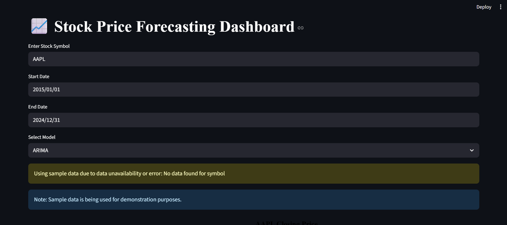
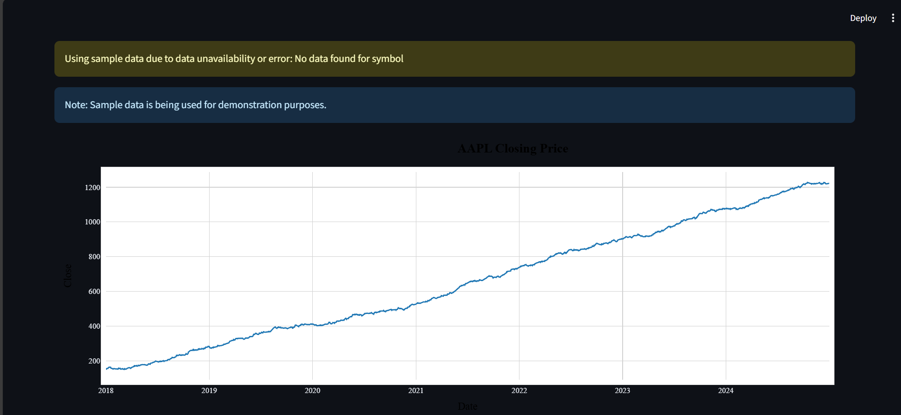
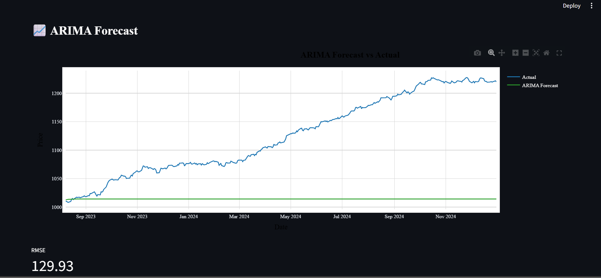
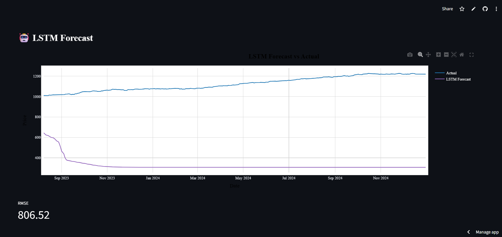
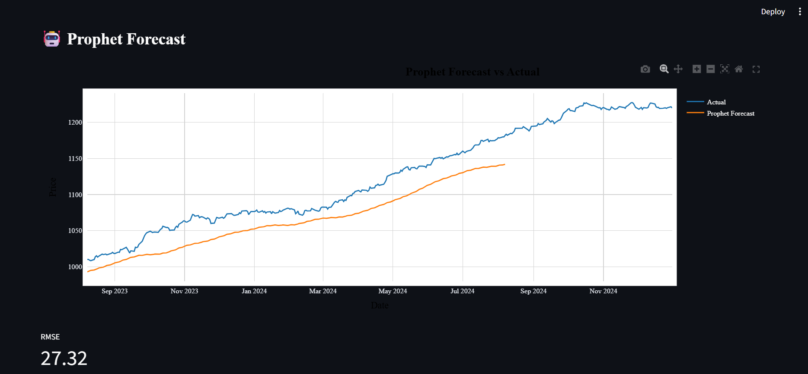
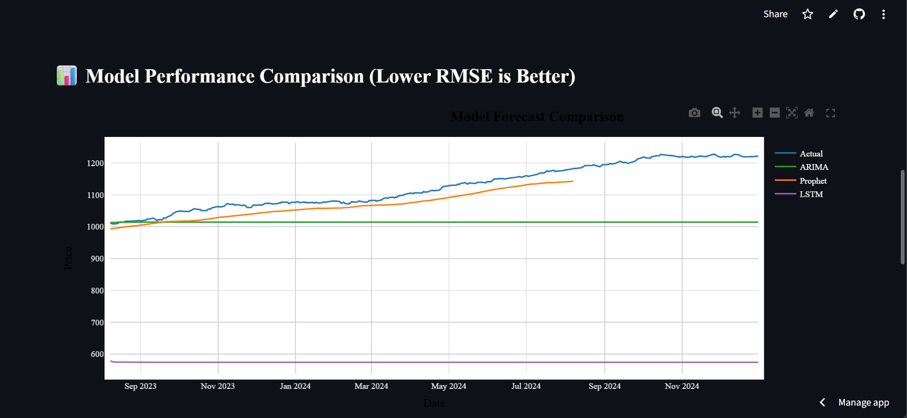
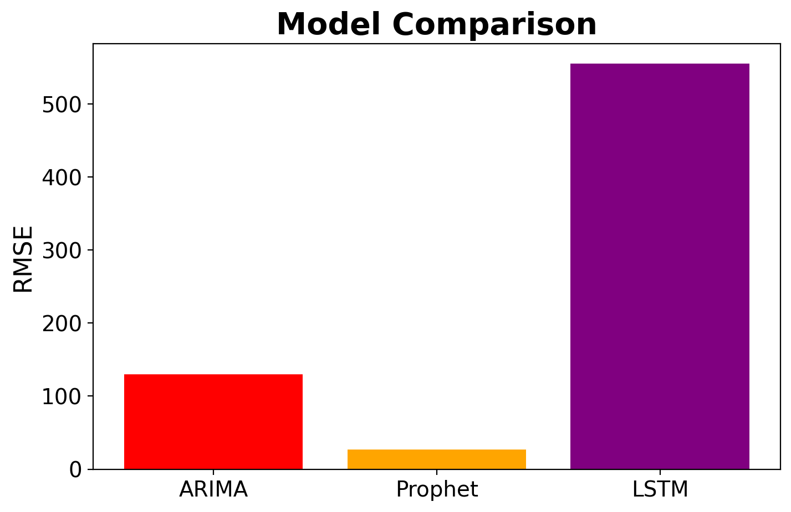

# 📈 Stock Price Forecasting Dashboard
 
An interactive dashboard for forecasting stock prices using ARIMA, LSTM, and optionally Prophet models. Built with Python and Streamlit during my internship at Zidio.

This is an interactive Streamlit-based dashboard that allows users to forecast stock prices using three popular models:
- **ARIMA**
- **Prophet**
- **LSTM**

Users can select a stock symbol, specify a date range, and choose a forecasting model. The app will visualize both actual and predicted prices and provide the RMSE (Root Mean Squared Error) to evaluate model performance.

---

### 🔗 Live Demo

👉 [Open the Streamlit App](https://stock-forecasting-dashboard-cqxxhtpwbxs4yer9s62v3f.streamlit.app/)

---

### 📊 Features

- 📌 User input for Stock Symbol, Start Date, End Date  
- 🔍 Real-time fetching of stock data via `yfinance`  
- 📉 Forecasting using:
  - ARIMA (red)
  - Prophet (orange-yellow)
  - LSTM (dark purple)
- 📈 Visual comparison of actual vs. predicted prices  
- 📦 RMSE performance metric  
- 🧠 Multi-model performance comparison chart  

---

### 🛠️ Models Used

| Model    | Description                                      | Color Used      |
|----------|--------------------------------------------------|-----------------|
| ARIMA    | Time series statistical model                    | 🔴 Red          |
| Prophet  | Additive model from Meta for time series         | 🟠 Orange-Yellow|
| LSTM     | Deep learning model for sequence prediction      | 🟣 Dark Purple  |

---

### 🧪 Sample Output Screens

#### 🔍 Search with Stock Input



---

#### 🎯 Dashboard Landing



---

#### 📕 ARIMA Forecast



---

#### 📘 LSTM Forecast



---

#### 📙 Prophet Forecast



---

#### 📊 Forecast Comparison



---

#### 📉 RMSE Bar Chart



---

### 📦 How to Run Locally

```bash
git clone https://github.com/yourusername/stock-forecasting-dashboard.git
cd stock-forecasting-dashboard
pip install -r requirements.txt
streamlit run app.py
```

---

### 💡 Note

If live data fetching fails (e.g., due to symbol error or connection), the app automatically loads sample data for demonstration.

---

### 📬 Feedback & Contributions

Pull requests are welcome. For major changes, please open an issue first to discuss what you would like to change.

---

### 🔒 License

[MIT License](LICENSE)
